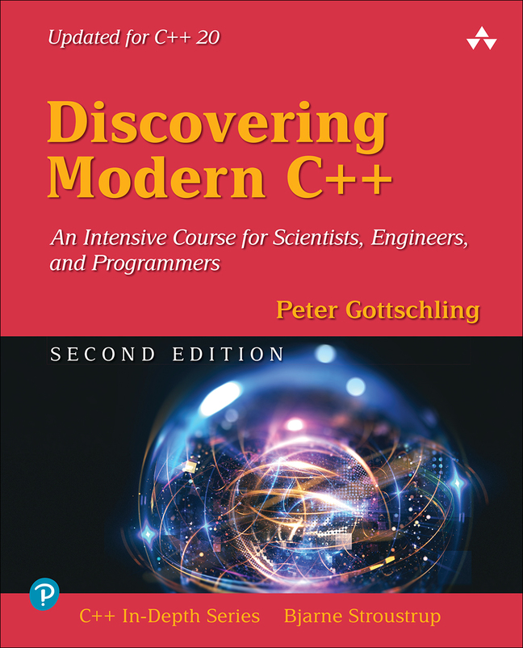

  
  
  

<!-- PROJECT LOGO -->
 

  
  
  <h3 align="center">Discovering Modern C++</h3>

  

  

    My walk-through over the book "Discovering Modern C++", written by Peter Gottschling (Addison-Wesley - Second Edition). An intensive course for scientists, engineers and programmers
     
     
    <a href="https://github.com/joaofaveri/discovering-modern-cpp/issues">Relatar um Bug</a>
    ·
    <a href="https://github.com/joaofaveri/discovering-modern-cpp/issues">Solicitar Feature</a>
  

## Description

Peter Gottschling’s Discovering Modern C++, Second Edition is an intensive introduction that guides you smoothly to sophisticated approaches based on advanced features. Thoroughly updated for C++17 and C++20, this Second Edition introduces key concepts using examples from many technical problem domains, drawing on his extensive experience training professionals and teaching C++ to students of physics, math, and engineering.

This book is designed to help students get started rapidly and then master increasingly robust features, from lambdas to expression templates. You’ll also learn how to take advantage of the powerful libraries available to C++ programmers: both the Standard Template Library (STL) and scientific libraries for arithmetic, linear algebra, differential equations, and graphs. In this Second Edition, Gottschling also presents thorough and expert coverage of multi-threading and variadic templates.

Throughout, Gottschling demonstrates how to write clear and expressive software using object orientation, generics, metaprogramming, and procedural techniques. By the time you’re finished, you’ll have mastered all the abstractions you need to write C++ programs with exceptional quality and performance.

## Contributing

Contributions are what make the open source community such an amazing place to learn, inspire, and create. Any contributions you make are **greatly appreciated**.

If you have a suggestion that would make this better, please fork the repo and create a pull request. You can also simply open an issue with the tag "enhancement".
Don't forget to give the project a star! Thanks again!

1. Fork the Project
2. Create your Feature Branch (`git checkout -b feature/AmazingFeature`)
3. Commit your Changes (`git commit -m 'Add some AmazingFeature'`)
4. Push to the Branch (`git push origin feature/AmazingFeature`)
5. Open a Pull Request

(<a href="#top">back to top</a>)

<!-- LICENSE -->
## License

Distributed under the MIT License. See `LICENSE.txt` for more information.

(<a href="#top">back to top</a>)

<!-- MARKDOWN LINKS & IMAGES -->
<!-- https://www.markdownguide.org/basic-syntax/#reference-style-links -->
[contributors-shield]: https://img.shields.io/github/contributors/joaofaveri/discovering-modern-cpp.svg?style=for-the-badge
[contributors-url]: https://github.com/joaofaveri/discovering-modern-cpp/graphs/contributors
[forks-shield]: https://img.shields.io/github/forks/joaofaveri/discovering-modern-cpp.svg?style=for-the-badge
[forks-url]: https://github.com/joaofaveri/discovering-modern-cpp/network/members
[stars-shield]: https://img.shields.io/github/stars/joaofaveri/discovering-modern-cpp.svg?style=for-the-badge
[stars-url]: https://github.com/joaofaveri/discovering-modern-cpp/stargazers
[issues-shield]: https://img.shields.io/github/issues/joaofaveri/discovering-modern-cpp.svg?style=for-the-badge
[issues-url]: https://github.com/joaofaveri/discovering-modern-cpp/issues
[license-shield]: https://img.shields.io/github/license/joaofaveri/discovering-modern-cpp.svg?style=for-the-badge
[license-url]: https://github.com/joaofaveri/discovering-modern-cpp/blob/master/LICENSE.txt
[linkedin-shield]: https://img.shields.io/badge/-LinkedIn-black.svg?style=for-the-badge&logo=linkedin&colorB=555
[linkedin-url]: https://linkedin.com/in/joaofaveri
